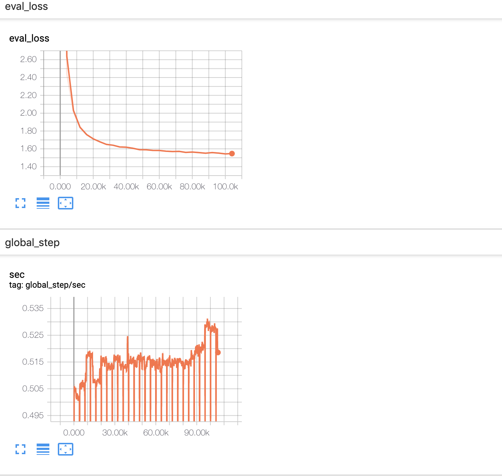
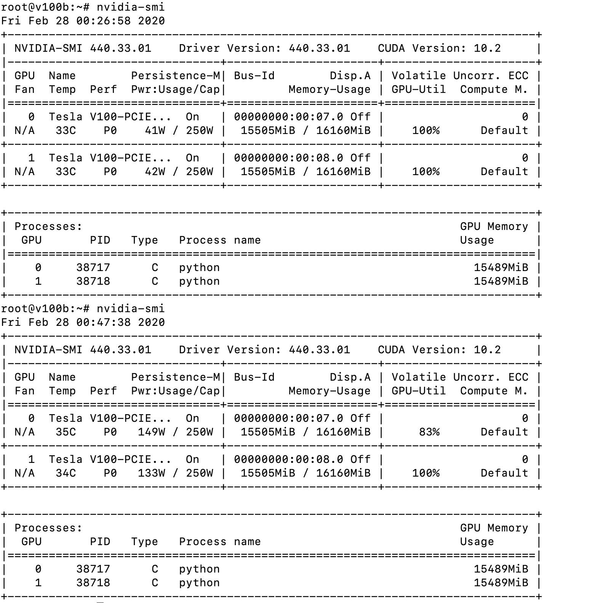
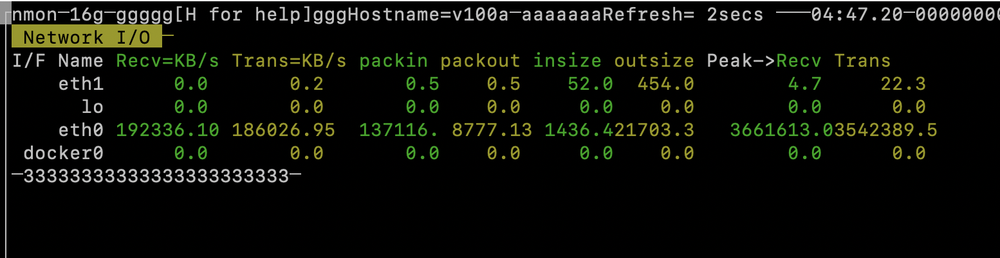
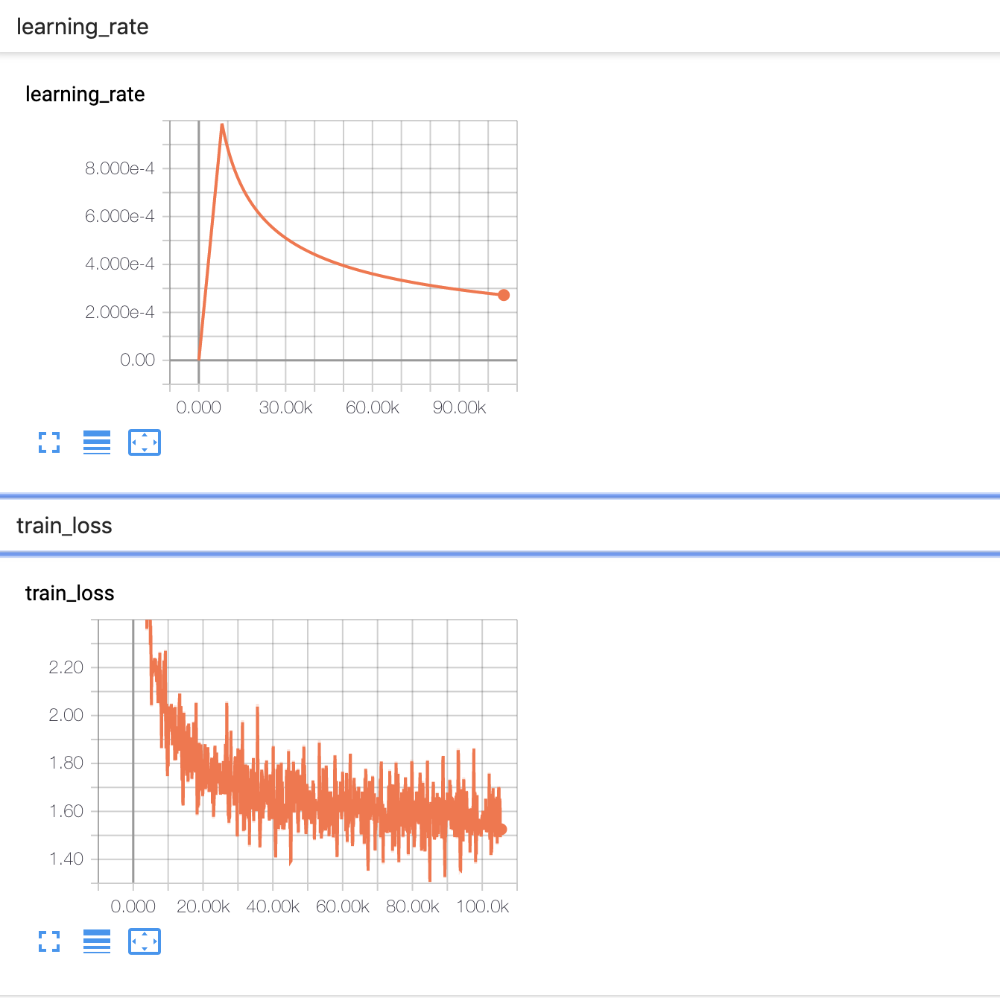

## Questions ##

* __How long does it take to complete the training run?__

I ran the training for a little over 100K steps. The training ran for a little over 2 days (48 hours).

* __Do you think your model is fully trained? How can you tell?__

The model was not fully trained since the *eval loss* was still trending down. But it looked like the bulk of training was done and there was gentle downward slope when I killed the job.


* __Were you overfitting?__

As mentioned above, the eval loss was still going down after 100K steps. And the training loss was not significantly lower then the eval loss. So I do not that the model was overfitting at this point.

* __Were your GPUs fully utilized?__

Yes, the GPUs were fully utilized. I looked at the output of **nvidia-smi** on the VMs and saw that the GPUs were using all memory and were **100%** utilized.


* __Did you monitor network traffic (hint: apt install nmon ) ? Was network the bottleneck?__

I used nmon, as suggested, and saw that the peak IO was around ~3.5MB/s in both directions. In my VM, I had requested 1Gb/s, which is roughtly 125MB/s, so I don't think network was the bottleneck. The dataset must have been split up between the VMs, and inter-node communication would be needed only when state was being updated (at the end of a step).


* __Take a look at the plot of the learning rate and then check the config file. Can you explan this setting?__

In the config file, the learning rate was specified as:
```
 'lr_policy': <function transformer_policy at 0x7f4899ef1ae8>,
 'lr_policy_params': {'d_model': 512,
                      'learning_rate': 2.0,
                      'warmup_steps': 8000},
```
We see from the plot that the learning rate goes up for the first 8000 or so steps, which is what the config file specifies. So I think the model is exploring the best learning rate to rate to start with initially, and it then decays the learning rate when ever the loss plateaus.


* How big was your training set (mb)? How many training lines did it contain?
* What are the files that a TF checkpoint is comprised of?
* How big is your resulting model checkpoint (mb)?
* Remember the definition of a "step". How long did an average step take?
* How does that correlate with the observed network utilization between nodes?
