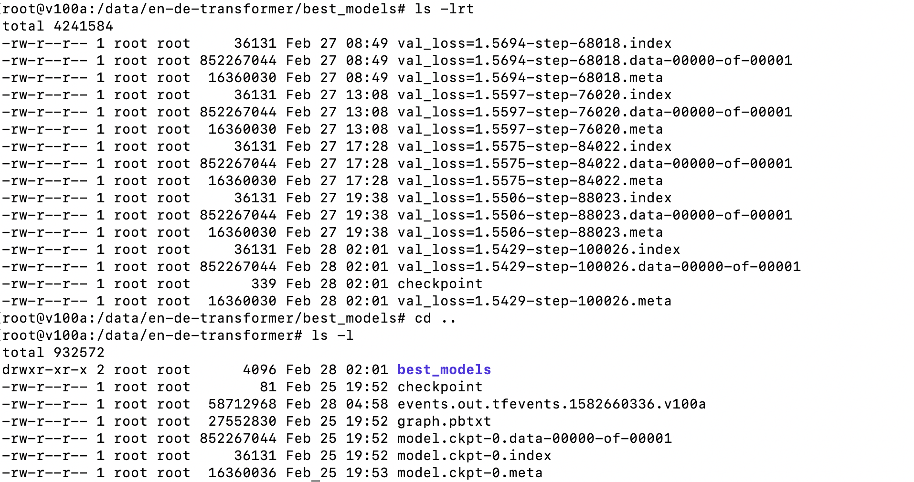

## Questions ##

* __How long does it take to complete the training run?__

I ran the training for a little over 100K steps. The training ran for a little over 2 days (48 hours).

* __Do you think your model is fully trained? How can you tell?__

The model was not fully trained since the *eval loss* was still trending down. But it looked like the bulk of training was done and there was gentle downward slope when I killed the job.


* __Were you overfitting?__

As mentioned above, the eval loss was still going down after 100K steps. And the training loss was not significantly lower then the eval loss. So I do not that the model was overfitting at this point.

* __Were your GPUs fully utilized?__

Yes, the GPUs were fully utilized. I looked at the output of **nvidia-smi** on the VMs and saw that the GPUs were using all memory and were **100%** utilized.


* __Did you monitor network traffic (hint: apt install nmon ) ? Was network the bottleneck?__

I used nmon, as suggested, and saw that the peak IO was around ~3.5MB/s in both directions. In my VM, I had requested 1Gb/s, which is roughtly 125MB/s, so I don't think network was the bottleneck. The dataset must have been split up between the VMs, and inter-node communication would be needed only when state was being updated (at the end of a step).


* __Take a look at the plot of the learning rate and then check the config file. Can you explan this setting?__

In the config file, the learning rate was specified as:
```
 'lr_policy': <function transformer_policy at 0x7f4899ef1ae8>,
 'lr_policy_params': {'d_model': 512,
                      'learning_rate': 2.0,
                      'warmup_steps': 8000},
```
We see from the plot that the learning rate goes up for the first 8000 or so steps, which is what the config file specifies. So I think the model is exploring the best learning rate to rate to start with initially, and it then decays the learning rate when ever the loss plateaus.


* __How big was your training set (mb)? How many training lines did it contain?__

The training set was around 620MB for English, and 690MB for German, totaling ~1.3GB. Each corpus had **4524868** records each.


* __What are the files that a TF checkpoint is comprised of?__

The TF checkpoint consists of an index file, the model file itself with the weights and a .meta file.


* __How big is your resulting model checkpoint (mb)?__

The models were around **850MB**.

* __Remember the definition of a "step". How long did an average step take?__

Each step took around 2 minutes:

```
*** Global step 61700: ***     Train loss: 1.6348 
time per step = 0:00:1.946
***     Train Source[0]:     <s> ▁The ▁tour ▁programs ▁last ▁2 — 7 ▁days ; ▁individual ▁tours ▁are ▁available ▁on ▁request . </s>
***     Train Target[0]:     <s> ▁Nur ▁der ▁Ba ikal see ▁ergibt ▁sich ▁nicht , ▁at met ▁unter ▁seiner ▁been genden ▁Eis de cke , ▁und ▁die ▁m ann ig falt igen ▁Eis geb il de ▁an ▁den ▁Felsen ▁und ▁Kl ippen ▁ze ugen ▁noch ▁von ▁seinem ▁wil den ▁her bst lichen ▁Kampf ▁mit ▁dem ▁Fro st , ▁der ▁ihn </s>
***     Train Prediction[0]: <s> ▁Die ▁2 ▁Ort uch see ▁ist ▁sich ▁aus ▁nur ▁sondern met ▁die ▁dem ▁Oberfläche gten ▁Oberfläche zeit cke . ▁sondern ▁ist ▁Sonne är ig falt igen , d unden de ▁sind ▁der ▁W . ▁die ippen . ugen ▁von ▁von ▁der ▁Reichtum den ▁Wasser ben lichen ▁Reichtum . ▁seinen ▁Wasser st . ▁der ▁die </s>
*** Global step 61800: ***     Train loss: 1.5468 
time per step = 0:00:1.949
***     Train Source[0]:     <s> ▁First ▁exp ands ▁beyond ▁Seattle ▁to ▁O ak land , ▁CA . </s>
***     Train Target[0]:     <s> ▁Erste ▁Exp ansion ▁über ▁Seattle ▁hinaus ▁nach ▁O ak land , ▁Kal ifornien . </s>
***     Train Prediction[0]: <s> ▁Die ▁Erweiterung ansion ▁nach ▁Seattle ▁hinaus ▁nach ▁O ak land , ▁CA ifornien . </s> </s> . </s> . . . . </s> </s> </s> . . . . . . </s> . . , . , . </s> . </s> . . ▁die . , </s> </s> </s> </s> </s> . </s> </s> </s>
*** Global step 61900: ***     Train loss: 1.5857 
time per step = 0:00:1.953
***     Train Source[0]:     <s> ▁He ▁had ▁asked ▁the ▁President ▁to ▁p ard on ▁Asia ▁Bib i , ▁a ▁Christian ▁woman ▁senten ced ▁to ▁death ▁for ▁bl as ph em y , ▁and ▁had ▁also ▁visited ▁her ▁in ▁prison . </s>
***     Train Target[0]:     <s> ▁Er ▁hat ▁den ▁Staat spräsidenten ▁gebeten , ▁Asia ▁Bib i , ▁eine ▁Christ in , ▁die ▁wegen ▁Bl as ph em ie ▁zum ▁To de ▁verurteilt ▁worden ▁ist , ▁zu ▁beg n ad igen , ▁und ▁hat ▁sie ▁auch ▁im ▁Gefängnis ▁besucht . </s>
***     Train Prediction[0]: <s> ▁Er ▁hatte ▁die ▁Präsidenten spräsidenten ▁gebeten , ▁Asia ▁Bib i ▁zu ▁eine ▁christ in , ▁die ▁wegen ▁Bl as ph em ie ▁zum ▁To de ▁verurteilt ▁wurde ▁war , ▁zu ▁beg n ad igen ▁und ▁und ▁auch ▁auch ▁auch ▁im ▁Gefängnis ▁besucht . </s> </s> . . </s> </s> ▁war , , </s> </s> </s>
*** Global step 62000: ***     Train loss: 1.5968 
time per step = 0:00:1.945
```

* __How does that correlate with the observed network utilization between nodes?__

At the end of each training step, the global state is updated. So network activity spikes around that time.
